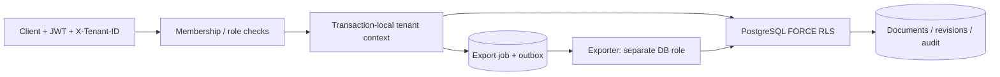

# 12. TenantDesk

**B2B SaaS для документов с изоляцией компаний в API и PostgreSQL RLS.**
Портфолио-проект уровня Middle+ Backend, создан в сентябре 2026 года.

## Что реализовано

- JWT-аутентификация и создание организаций.
- Роли `owner`, `editor`, `viewer`; приглашения по одноразовому токену с TTL
  и проверкой email приглашённого пользователя.
- Текстовые документы, история содержимого, оптимистические версии через `If-Match`.
- Мягкое удаление, корзина и восстановление с проверкой квоты.
- Квоты активных документов, хранимых UTF-8 байтов с учётом всех редакций и участников.
- Журнал действий, который API-роль может только читать и дополнять.
- Фоновый экспорт JSON: долговременный outbox, отдельная роль БД,
  повторная проверка членства и изоляция выборки RLS.
- Миграции, идемпотентный seed, OpenAPI, метрики, Docker и CI.

## Запуск

```bash
cd ~/Desktop/Python-Backend-Portfolio/12-tenantdesk
docker compose up --build -d --wait --wait-timeout 180
docker compose exec -T api python scripts/smoke.py
```

Swagger: <http://localhost:8120/docs>.
Локальный владелец: `owner@example.com` / `TenantDeskDemo123!`.
Демо-организация: `12000000-0000-0000-0000-000000000010`.

После `POST /auth/login` установить Bearer token через **Authorize**.
Для маршрутов организации передавать её ID в `X-Tenant-ID`.
Для изменения документа передавать текущий ETag в `If-Match`, например `"1"`.
Также принимается числовая запись `1`.

## Основной сценарий

1. `POST /tenants`, `GET /tenants` — создать организацию или найти свои.
2. `POST /invitations` — получить токен для конкретного email и роли.
3. Приглашённый пользователь вызывает `POST /invitations/accept`.
   Рассылки писем нет: токен передаётся владельцем самостоятельно.
4. `POST /documents`, `PUT /documents/{id}` — создать документ и редакцию.
5. `DELETE /documents/{id}`, `POST /documents/{id}/restore` — корзина.
6. `POST /exports` с `Idempotency-Key` — запросить снимок активных документов.
7. `GET /exports/{id}` и `/download` — получить статус и JSON.
8. `GET /audit` — просмотреть журнал владельцу организации.

## Изоляция и архитектура

API подтверждает членство пользователя в выбранной компании. Затем все операции
идут в одной транзакции с локальным tenant-контекстом. Политики RLS фильтруют
документы, редакции, приглашения, аудит и экспорты даже при пропущенном фильтре
в прикладном SELECT. API и worker не владеют таблицами и не имеют BYPASSRLS.



## Проверки

```bash
make check
make test
make smoke
```

Тесты выполняются под настоящими ограниченными ролями PostgreSQL и проверяют
RLS без tenant-фильтра, сброс контекста в пуле, подмену компании в заголовке,
права viewer, одноразовые приглашения, конкурентные квоты, конфликты версий,
восстановление, изолированные экспорты и отзыв доступа до обработки задания.

Подробности: [архитектура и границы RLS](docs/architecture.md),
[эксплуатация](docs/runbook.md), [проверенные результаты](docs/verification.md),
[объяснение для интервью](docs/interview.md).

## Границы проекта

Хранятся текстовые документы, без файловых вложений и внешнего S3. По умолчанию
организация имеет 100 активных документов, 10 MiB истории и 10 участников.
Отдельный документ ограничен 100 000 символов тела. Экспорт ограничен 2 MiB и
20 сохранёнными заданиями на компанию; старые экспорты можно удалить.
Удаление документа освобождает активный слот, но сохраняет историю и её объём.

Стек: Python 3.12, FastAPI, SQLAlchemy Core/asyncpg, PostgreSQL 17 RLS,
Alembic, JWT, Argon2, Docker Compose, pytest, Ruff.

## English

TenantDesk is a document SaaS backend with organization roles, single-use
invitations, revision-aware quotas and soft-delete recovery. PostgreSQL RLS
protects tenant content in both API requests and background exports, with
integration tests running as non-owner database roles.
